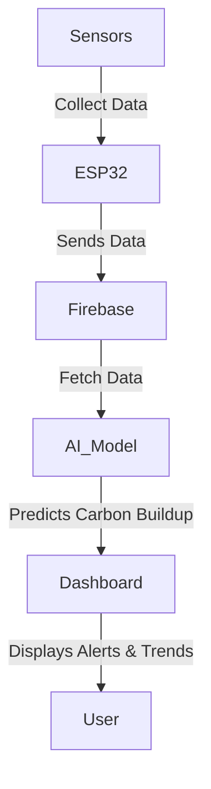
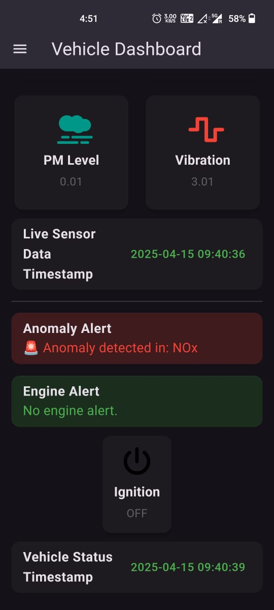
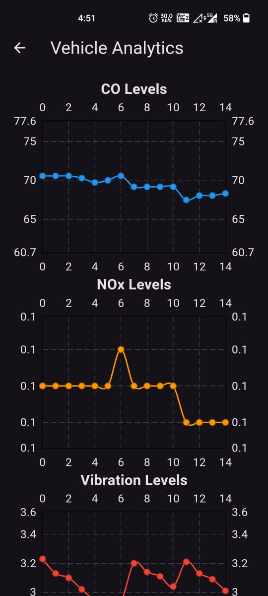
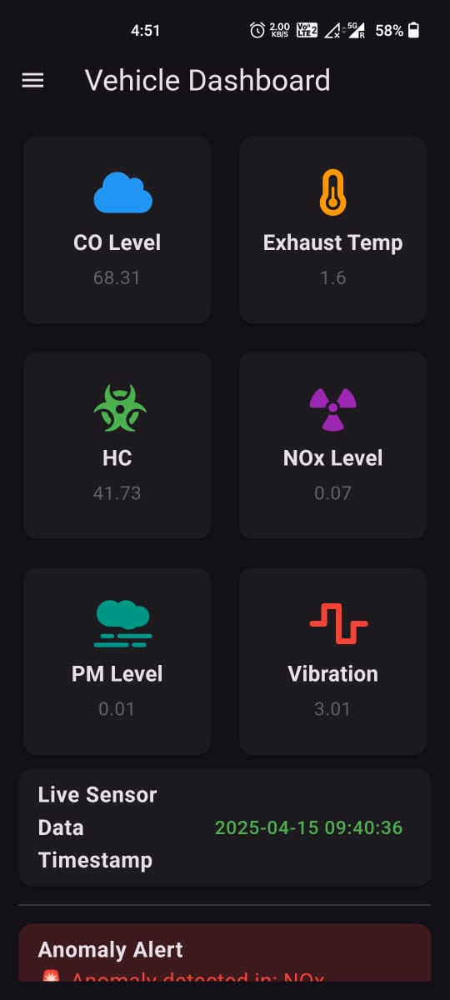
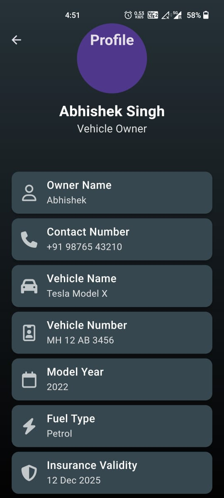
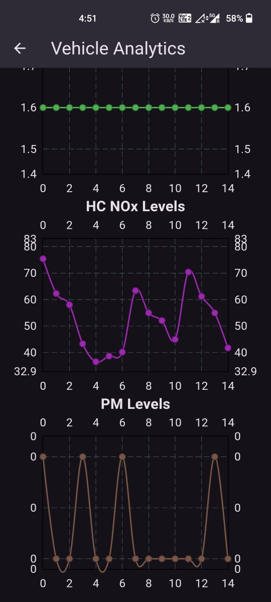
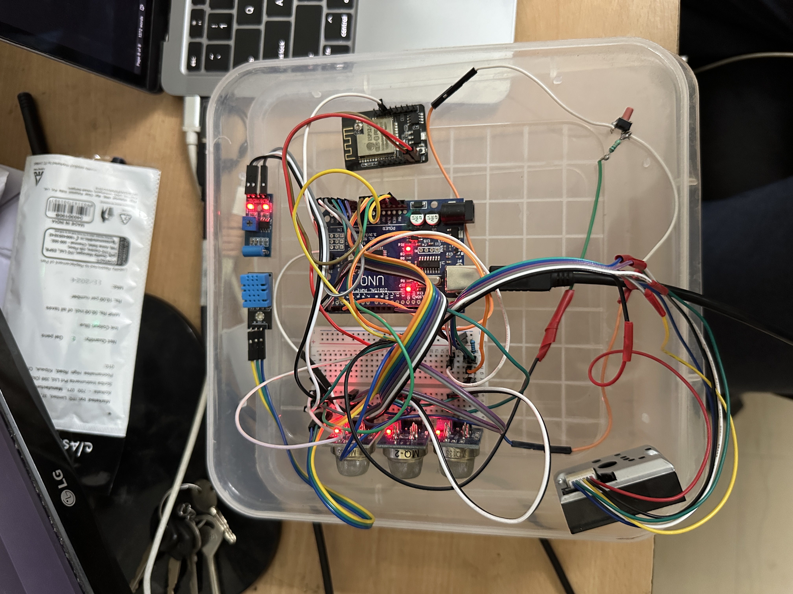

# 🚗 IoT-Based Predictive Maintenance for Vehicle Engines

## 📌 Overview
This project is an **Engine-Carbon-Deposition-Prediction-Predictive-Analytics** designed to estimate **carbon buildup in vehicle engines** using **low-cost sensors and AI-driven trend analysis**. Instead of relying on OBD-II data, this system collects exhaust gas composition, vibration, and temperature data to **predict carbon deposits**, helping users take preventive maintenance actions before engine performance is affected.

## 🎯 Key Features
✅ **Real-time engine health monitoring**  
✅ **Low-cost sensor-based approach (No OBD-II dependency)**  
✅ **AI-driven trend analysis using LSTM & anomaly detection**  
✅ **Cloud-based data storage with Firebase Firestore**  
✅ **Flutter-based dashboard for visualization**  
✅ **Energy-efficient data collection strategy**  

## 🔧 System Architecture
The system consists of the following components:

### **1️⃣ Data Collection (Edge Device: Arduino & ESP32)**
- **MQ-7 (CO Sensor):** Detects carbon monoxide levels in exhaust.
- **MQ-135 (NOx & HC Sensor - 2 units):** Measures nitrogen oxides and hydrocarbons.
- **Dust Sensor (PM Sensor):** Detects particulate matter.
- **DHT11 (Temperature Sensor):** Monitors exhaust temperature.
- **Vibration Sensor:** Analyzes irregular combustion patterns.
- **Ignition Switch Sensor:** Logs data only when the engine is ON.

### **2️⃣ Data Transmission & Storage**
- ESP32 transmits sensor data to **Firebase Firestore**.
- Data is structured for **efficient retrieval & analysis**.

### **3️⃣ AI Model for Prediction & Anomaly Detection**
- **LSTM (Long Short-Term Memory)** for **trend analysis**.
- **Isolation Forest** for **anomaly detection**.
- **ARIMA forecasting** for **future carbon buildup estimation**.

### **4️⃣ Visualization & Alerts**
- **Flutter-based dashboard** for real-time monitoring.
- **Alerts & notifications** for excessive carbon deposits.

## 🚀 Getting Started

### **🔹 Hardware Requirements**
- **Arduino Uno** (Microcontroller)
- **ESP32** (WiFi Module)
- **MQ-7 Sensor** (Carbon Monoxide)
- **MQ-135 Sensor** (Nitrogen Oxides & Hydrocarbons)
- **DHT11 Sensor** (Temperature)
- **Vibration Sensor**
- **PM Sensor** (Dust & Particulates)
- **Switch for Engine ON/OFF Detection**

### **🔹 Software Requirements**
- **Arduino IDE** (For programming the Arduino & ESP32)
- **Firebase Firestore** (For cloud data storage)
- **Python (NumPy, Pandas, TensorFlow, SciPy)** (For AI model training)
- **Flutter** (For the mobile/web dashboard)
- **Node.js & Express** (For API & database integration)

### **🔹 Installation & Setup**
#### 1️⃣ **Arduino & ESP32 Setup**
- Install **Arduino IDE** and required board support packages.
- Upload the firmware to **Arduino Uno & ESP32**.

#### 2️⃣ **Firebase Firestore Configuration**
- Create a Firebase project.
- Set up **Firestore Database**.
- Update Firebase credentials in the **ESP32 firmware**.

#### 3️⃣ **Backend & API (Node.js & Express)**
```bash
# Clone the repository
git clone https://github.com/your-repo-name.git](https://github.com/Sri-Ganesan-M/Engine-Carbon-Deposition-Prediction-Predictive-Analytics
cd Engine-Carbon-Deposition-Prediction-Predictive-Analytics/backend

# Install dependencies
npm install

# Run the server
node server.js
```

#### 4️⃣ **AI Model Training (Python)**
```bash
# Install dependencies
pip install numpy pandas tensorflow scikit-learn statsmodels

# Train the LSTM model
python train_model.py
```

#### 5️⃣ **Flutter Dashboard**
```bash
# Navigate to the frontend directory
cd your-repo-name/frontend

# Install dependencies
flutter pub get

# Run the app
flutter run
```

## 📊 Data Flow Diagram

<h3 align="center">📊 Dashboard Snapshots</h3>

<p align="center">
  
  
  
</p>

<p align="center">
  
  
  
</p>

<hr/>

<h3 align="center">🛠️ Implementation Snapshot</h3>

<p align="center">
  
</p>

## 🛠 Future Improvements
- 🔄 **Enhanced Sensor Calibration** for more accurate readings.
- 📡 **Edge Computing** for on-device AI processing.
- 🌍 **Geolocation-based Carbon Mapping** for city-wide analysis.
- 📲 **Mobile App Integration** for wider accessibility.

## 🤝 Contributing
Want to contribute? Feel free to **fork** this repository and submit a **pull request** with improvements!


---

🚀 *Developed with passion for innovation in automotive maintenance!*
